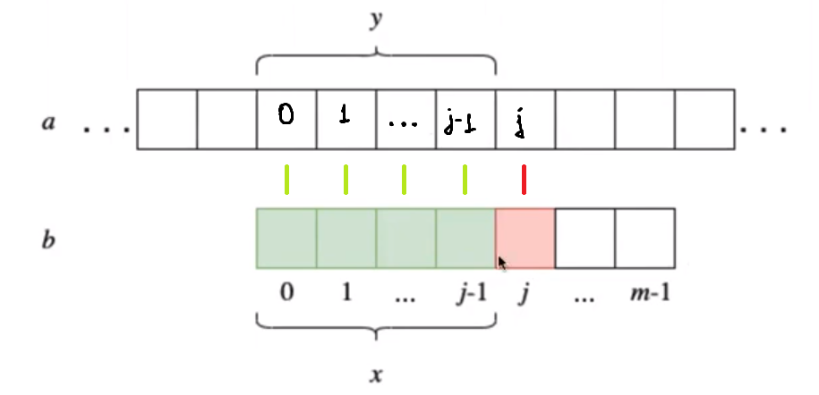
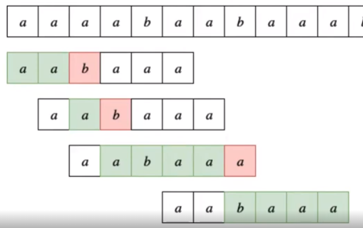

Busqueda en texto

# **Parametros que recibe la búsqueda**:
> - Un string con largo **n**
> - Un patron con largo **m**
> - El largo del alfabeto $\sigma$

# **Método de fuerza burta**:

> - El patrón y el string están perfectamente alineados. Si dentro del texto está exactamente el patrón, entonces es ``éxito``.
> - Por cada intento fallido, corremos el substring en un espacio extra hasta dar con el texto en el string o quedarnos sin más string que revisar.
> - Por ende, el peor caso es de orden ``O(n x m)``, mientras que el esperado es ``O(n)``, donde este último corresponde a básicamente, tener que recorrer todo el string

# **Algoritmo de Knuth-Morris-Pratt**:

> El principio base de este algoritmo básicamente consiste en tratar de deducir cuanto es necesario desplazar el patrón sin tener que hacer ninguna comparación entre medio para poder dar con el acierto, en función del largo la coincidencia entre el patrón y el string a analizar.

> Tal y como se ve en la imágen, hay una coincidencia entre ambas partes, pero hay un error en el carácter "J" y el resto ``[j-1, m-1]`` se desconoce, pues no fue comparado.
Así que la idea es que desplazar el `patrón "b"` de modo que el **prefijo más grande** del area desplazada posible calce con el **sufijo más grande** del patrón sin desplazar, lo que equivale a moverse la menor cantidad de caracácteres posibles sin llegar a pasar un sector clave que podría contener el patrón buscado.
> > `Prefijo es leer desde izquierda a derecha y Sufijo desde la derecha a la izquierda`
> 
>Siempre debemos quedarnos con el $x$ más grande que calce con el $y$ más grande. Esto nos asegura que no nos pasaremos una configuración de comparación exitosa. Todo esto se adquiere mediante la *función de fracaso $f(j)$*, donde $j$ corresponde a la parte que se alcanzó a revisar y está correcta, y retorna el largo de dicho $x$.

 

# **¿Como es que esto funciona?**

> Debemos generar la tabla de **la función de fracaso $f(j)$** la cual se construye a partir exclusivamente del patrón. Lo que debemos hacer con dicho patrón es iterativamente tomar prefijos de distintos largos de el, de modo que dado largo $j$, este vive en el rango $[1, len(patron)]$. Cada uno de los prefijos extraidos debe ser a su vez divido en un prefijo y sufijo, y la idea es ver si el sufijo existe en el prefijo. En caso de no existir, se retorna 0 y si existe 

 

# **Ejemplo**:

> ## Definir la función de fracaso $f(j)$:
> Sea el patrón $aabaaa$. Debemos adquirir prefijos iterativamente de largo 1 hasta largo 6. De modo que:
> | $j$  |  Patrón  |         Prefijos          |          Sufijos          | maxlen p^s) |
> | :--- | :------: | :-----------------------: | :-----------------------: | ----------: |
> | $1$  |   $a$    |         $\empty$          |            $a$            |         $0$ |
> | $2$  |   $aa$   |            $a$            |            $a$            |         $1$ |
> | $3$  |  $aab$   |          $a, aa$          |          $b, ab$          |         $0$ |
> | $4$  |  $aaba$  |       $a, aa, aab$        |       $a, ba, aba$        |         $1$ |
> | $5$  | $aabaa$  |    $a, aa, aab, aaba$     |    $a, aa, baa, abaa$     |         $2$ |
> | $6$  | $aabaaa$ | $a, aa, aab, aaba, aabaa$ | $a, aa, aaa, aaab, aaaba$ |         $2$ |
 

> ## Utilizar la tabla para encontrar el patrón en un string:
> Sea el patrón $p = aabaa$ y el string $s = aaaabaabaaabb$. Alimeanmos ambos y empezamos a comparar.

>En la primera comparación hubo 2 comparaciones exitosas, así que vamos a la tabla y vemos $j=2$ el cual nos indica que debemos desplazar el patrón de modo que $p[f(j=2)]$ esté alineado con el lugar donde ocurrió el fracaso. En la segunda comparación sabemos que ya tenemos un acierto acumulado y ahora tenemos otro, por lo que nuevamente vemos $j=2$ y alineamos con $p[f(j=2)]$ . En la tercera comparación tenemos 4 aciertos más el que estaba acumulado, por lo que alineamos con $p[j=5]$

> ## ¿Cómo se programa?
>       def fracaso(p):
>           m = len(b)
>           f = [0] * (m+1) ## Crea una lista de puros 0's de largo m+1
>           for j in range (1, m): 
>               i = f[j]    ## Inicialmente f[j] es 0
>               while i>0 and b[i] != b[j]:
>                   i = f[i]
>               if b[i] == b[j]:
>                   f[j+1] = i+1
>               else:
>                   f[j+1] = 0
>           return f
> Desarrollemos la idea desde el inicio. Al principio tendremos una lista de puros ceros que corresponde a la tabla de fracasos y en la primera iteración, setea `i = f[j] = 0`, razón por la cual no puede ingresar al `while`. Considerando que el valor inicial de `j` es `1`, entonces el `if/else` se encarga de comparar si el primer y segundo caracter del patrón son iguales o no.
> > En caso de ser iguales, se encarga de reportar en en array $f$ que hubo un match al modificar a dicho arreglo. Si no, setea el 0 pues no hay match. De esto se desprende que básicamente como encadenar los match y si se cae la cadena, el siguiente valor será 0.
